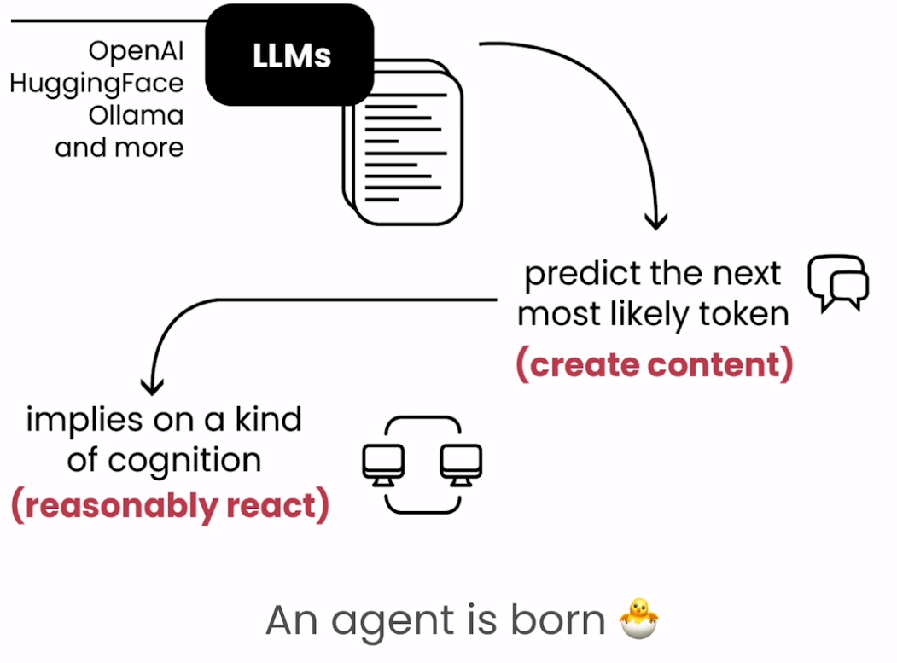
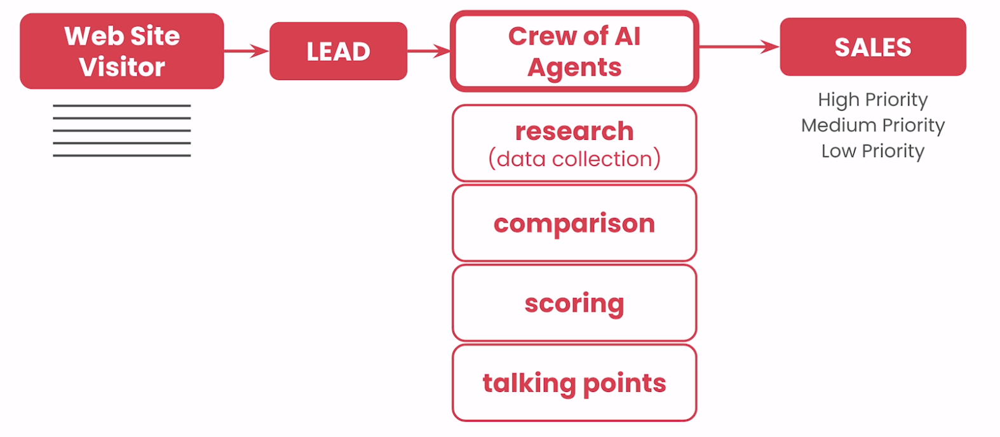
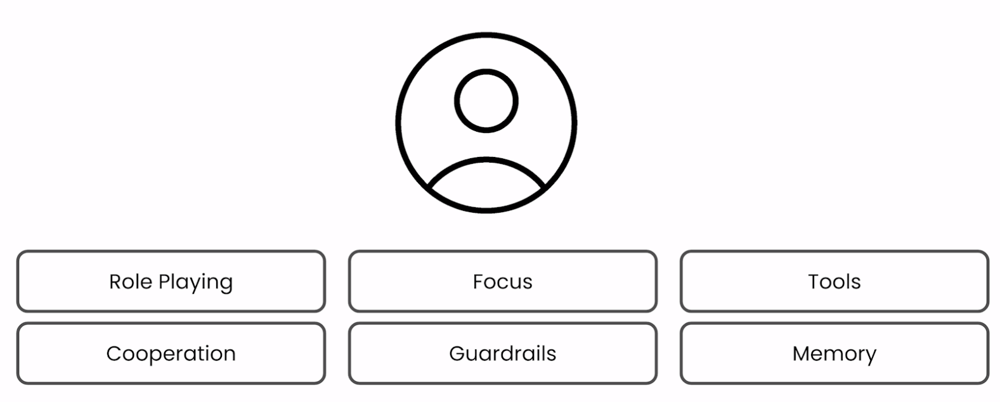
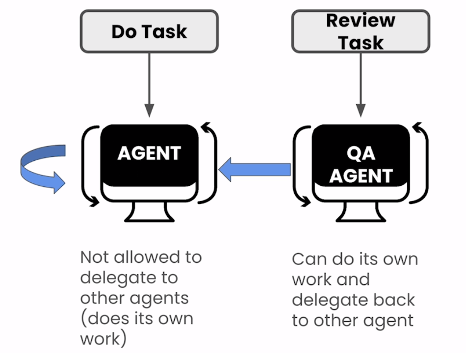
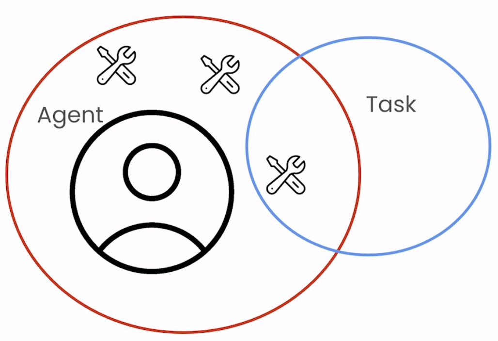
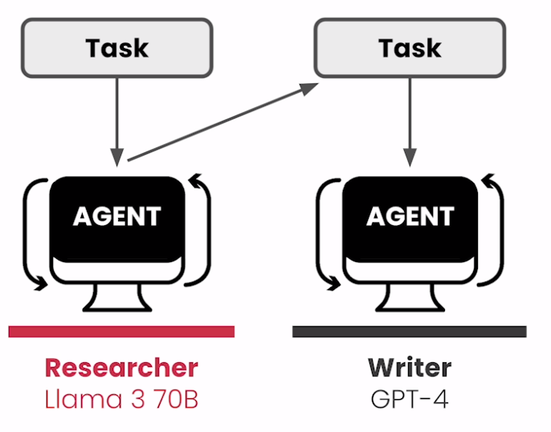

# 🧑‍🤝‍🧑 [Multi AI Agent Systems with crewAI](https://www.deeplearning.ai/short-courses/multi-ai-agent-systems-with-crewai/)

💡 Welcome to the "Multi AI Agent Systems with crewAI" course! This course will equip you with the knowledge and skills to design effective AI agents and organize a team of AI agents to perform complex, multi-step tasks.

 

 

## Course Summary
In this course, you'll explore the key principles of designing and organizing AI agents to automate common business processes. Here's what you can expect to learn and experience:

 

1. 🎭 **Role-playing**: Assign specialized roles to agents for effective task performance.
2. 🧠 **Memory**: Provide agents with short-term, long-term, and shared memory for better context handling.
3. 🛠️ **Tools**: Assign pre-built and custom tools to each agent, such as tools for web search.

 
 

4. 🎯 **Focus**: Break down tasks, goals, and tools and assign them to multiple AI agents for improved performance.
5. 🚦 **Guardrails**: Effectively handle errors, hallucinations, and infinite loops to ensure reliable task execution.
6. 🤝 **Cooperation**: Perform tasks in series, in parallel, and hierarchically to optimize workflow.

Throughout the course, you'll work with crewAI, an open source library designed for building multi-agent systems. You'll learn to build agent crews that execute common business processes, such as:

- 📄 Tailoring resumes and preparing for job interviews.
- 📝 Researching, writing, and editing technical articles.

 

- 📞 Automating customer support inquiries.
- 📧 Conducting customer outreach campaigns.
- 🎉 Planning and executing events.
- 💼 Performing financial analysis.

By the end of the course, you will have designed several multi-agent systems to assist you in common business processes and studied the key principles of AI agent systems.

## Key Points
- 🤖 Exceed the performance of prompting a single LLM by designing and prompting a team of AI agents through natural language.
- ⚙️ Use the open source library, crewAI, to automate repeatable, multi-step tasks like tailoring a resume to a job description and automating business processes typically done by a group of people, like event planning.
- 👥 By creating a team of AI agents, you can define a specific role, goal, and backstory for each agent, which breaks down complex multi-step tasks and assigns them to agents customized to perform those tasks.

## About the Instructor
🌟 **João Moura** is the founder and CEO of CrewAI, bringing extensive expertise in multi-agent systems and AI automation to guide you through this course.

🔗 To enroll in the course or for further information, visit [deeplearning.ai](https://www.deeplearning.ai/short-courses/).
